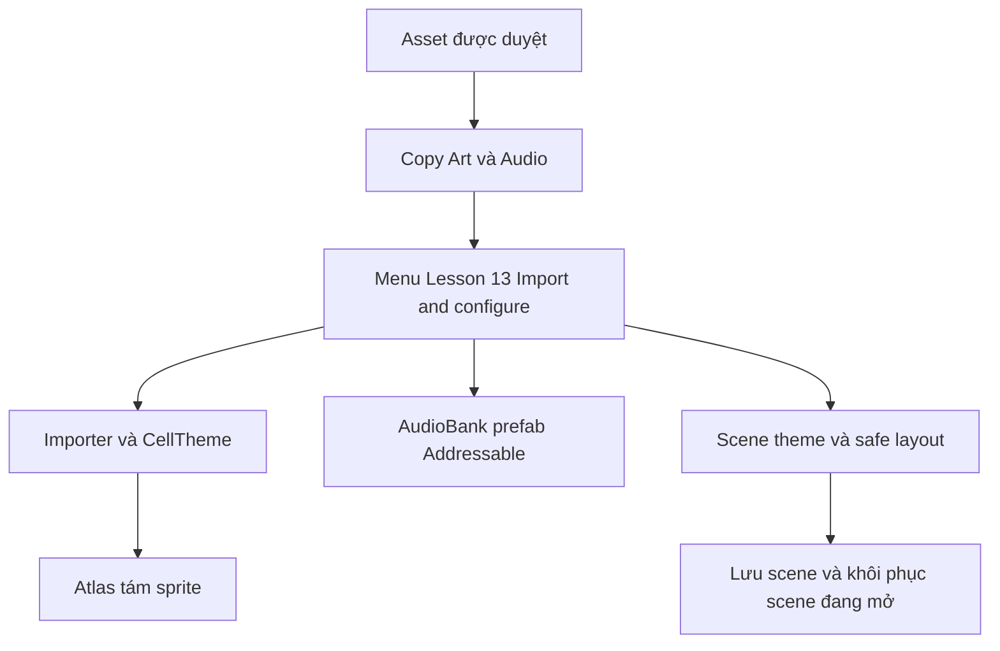
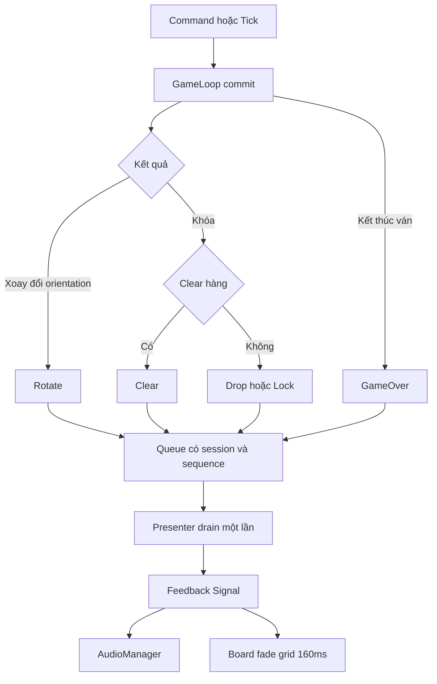
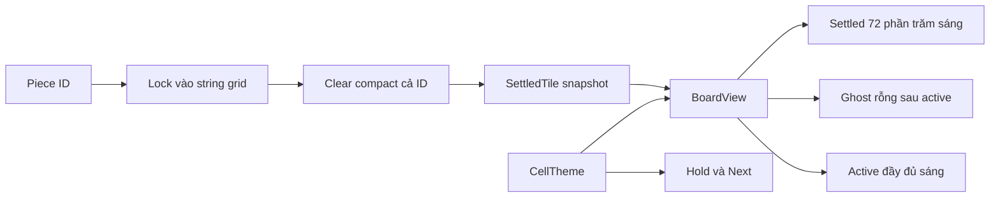
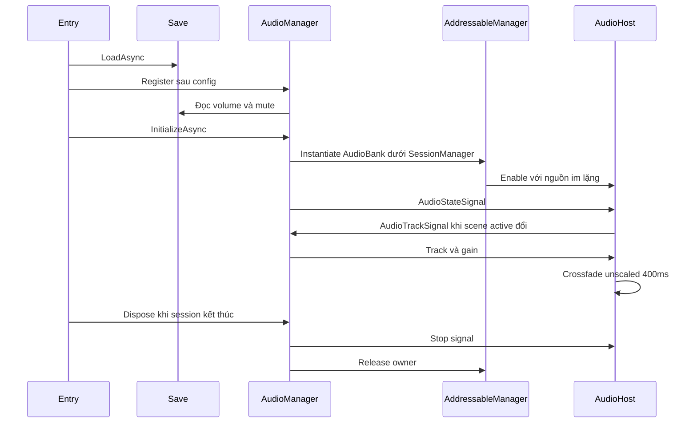
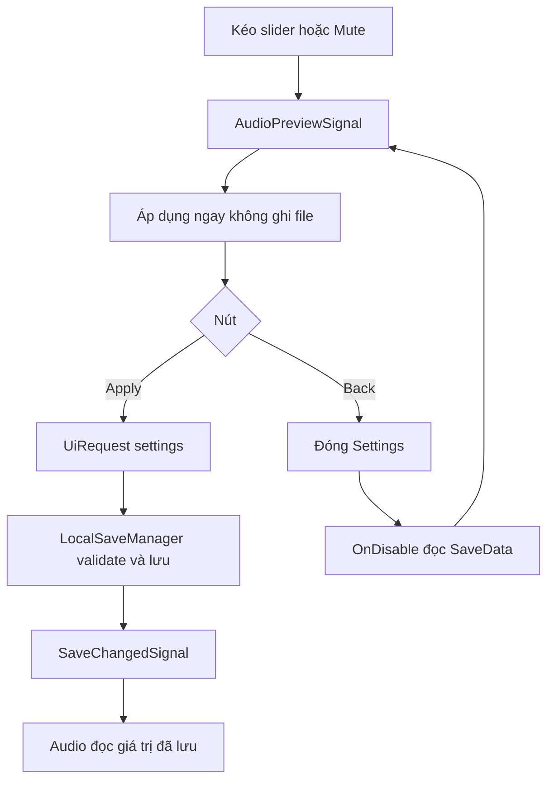
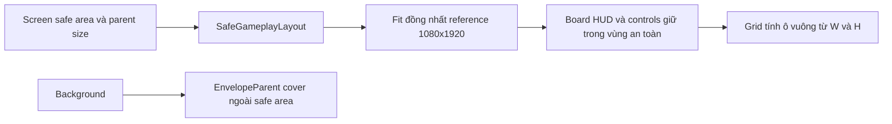

# Bài 13 — Workflow đã triển khai

## Asset và setup

```mermaid
flowchart TD
  A[Asset được duyệt] --> B[Copy Art và Audio]
  B --> C[Menu Lesson 13 Import and configure]
  C --> D[Importer và CellTheme]
  D --> E[Atlas tám sprite]
  C --> F[AudioBank prefab Addressable]
  C --> G[Scene theme và safe layout]
  G --> H[Lưu scene và khôi phục scene đang mở]
```

## Gameplay feedback

```mermaid
flowchart TD
  A[Command hoặc Tick] --> B[GameLoop commit]
  B --> C{Kết quả}
  C -->|Xoay đổi orientation| D[Rotate]
  C -->|Khóa| E{Clear hàng}
  E -->|Có| F[Clear]
  E -->|Không| G[Drop hoặc Lock]
  B -->|Kết thúc ván| H[GameOver]
  D --> I[Queue có session và sequence]
  F --> I
  G --> I
  H --> I
  I --> J[Presenter drain một lần]
  J --> K[Feedback Signal]
  K --> L[AudioManager]
  K --> M[Board fade grid 160ms]
```

## Render giữ ID

```mermaid
flowchart LR
  A[Piece ID] --> B[Lock vào string grid]
  B --> C[Clear compact cả ID]
  C --> D[SettledTile snapshot]
  D --> E[BoardView]
  F[CellTheme] --> E
  F --> G[Hold và Next]
  E --> H[Settled 72 phần trăm sáng]
  E --> I[Ghost rỗng sau active]
  E --> J[Active đầy đủ sáng]
```

## Audio session

```mermaid
sequenceDiagram
  participant Entry
  participant Save
  participant Manager as AudioManager
  participant Assets as AddressableManager
  participant Host as AudioHost
  Entry->>Save: LoadAsync
  Entry->>Manager: Register sau config
  Manager->>Save: Đọc volume và mute
  Entry->>Manager: InitializeAsync
  Manager->>Assets: Instantiate AudioBank dưới SessionManager
  Assets->>Host: Enable với nguồn im lặng
  Manager->>Host: AudioStateSignal
  Host->>Manager: AudioTrackSignal khi scene active đổi
  Manager->>Host: Track và gain
  Host->>Host: Crossfade unscaled 400ms
  Entry->>Manager: Dispose khi session kết thúc
  Manager->>Host: Stop signal
  Manager->>Assets: Release owner
```

## Settings preview và lưu

```mermaid
flowchart TD
  A[Kéo slider hoặc Mute] --> B[AudioPreviewSignal]
  B --> C[Áp dụng ngay không ghi file]
  C --> D{Nút}
  D -->|Apply| E[UiRequest settings]
  E --> F[LocalSaveManager validate và lưu]
  F --> G[SaveChangedSignal]
  G --> H[Audio đọc giá trị đã lưu]
  D -->|Back| I[Đóng Settings]
  I --> J[OnDisable đọc SaveData]
  J --> B
```

## Responsive

```mermaid
flowchart LR
  A[Screen safe area và parent size] --> B[SafeGameplayLayout]
  B --> C[Fit đồng nhất reference 1080x1920]
  C --> D[Board HUD và controls giữ trong vùng an toàn]
  E[Background] --> F[EnvelopeParent cover ngoài safe area]
  D --> G[Grid tính ô vuông từ W và H]
```
